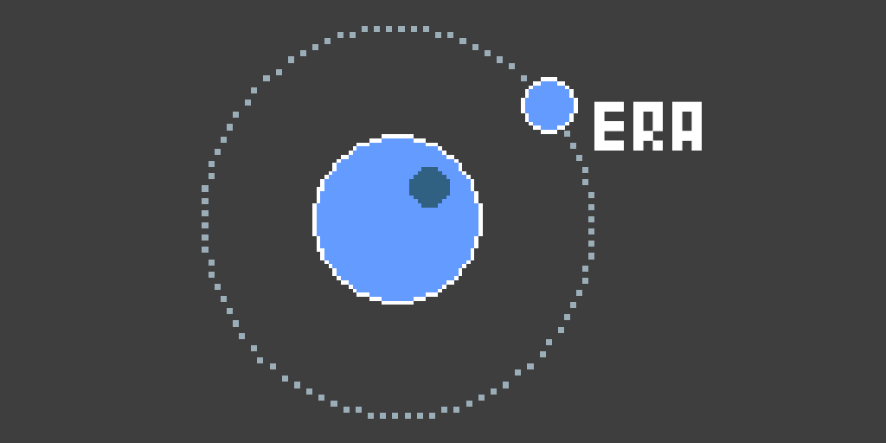

# uLuaera


用Lua开发eralike游戏吧

从工程开始
---------

git clone 本工程。

使用Unity选择工程文件夹，打开*Scenes/Main.unity*。

使用各位自己喜欢的文本编辑工具打开Assets/Lua/Entry.lua文件

从Standalone开始
---------------

下载Standalone版本

解压到磁盘目录。

使用各位自己喜欢的文本编辑工具打开./Lua/Entry.lua文件

编写代码
-------

```lua
function Init()
end

function Exec()
    PrintLn("Hello World!")
end

return {Init = Init, Exec = Exec}
```

文档
----
[API Reference](./Doc/api.md)
